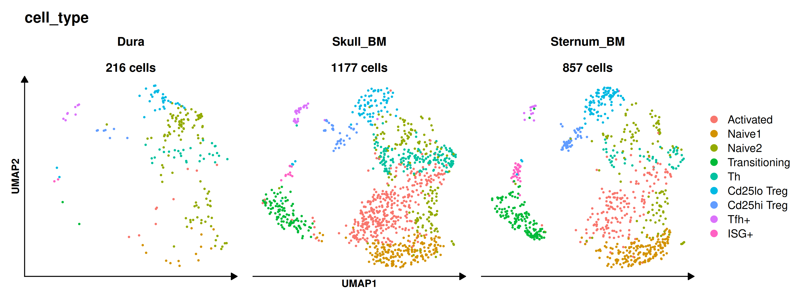
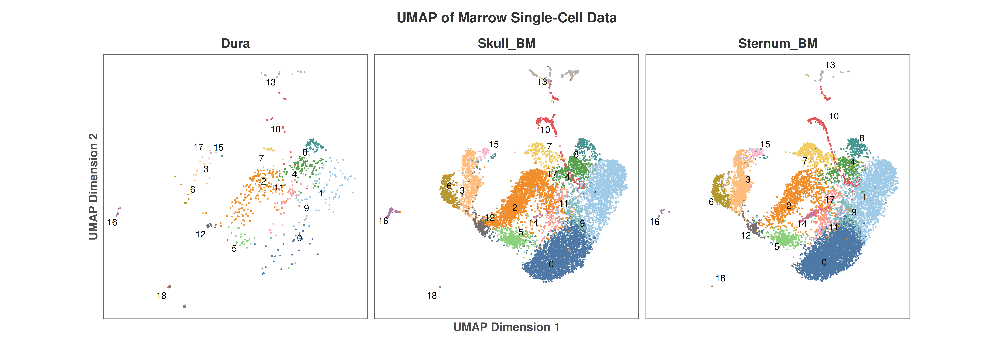
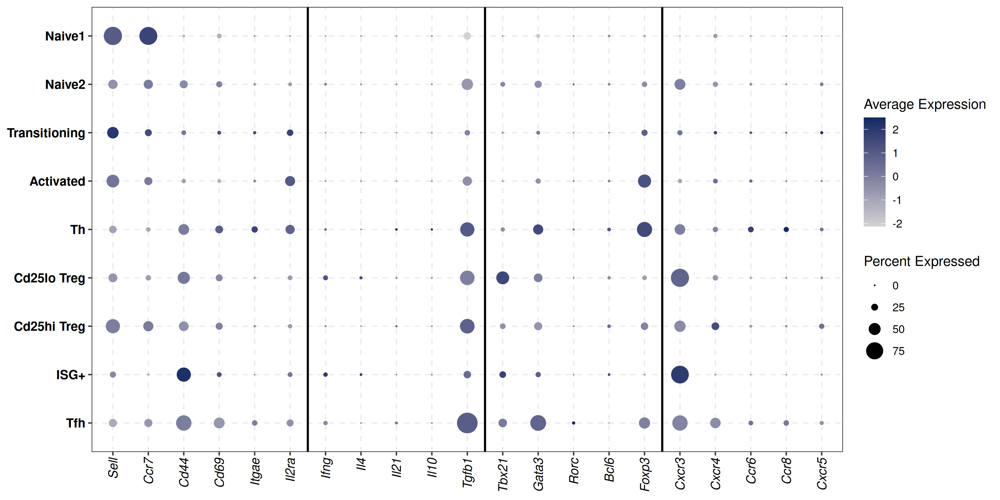

Single-Cell Profiling of Skull Bone Marrow T Cell Heterogeneity

Biological Hypothesis and Overview

The central nervous system was long considered an immunologically privileged site. However, recent discoveries show vascular connections between the skull bone marrow and the dural meninges. 

This project explores whether the skull bone marrow acts as a specialized immune microenvironment for local surveillance, distinct from systemic long bones like the sternum and downstream tissues like the dura. 

Using scRNA-seq, we mapped T cell diversity across these three niches to examine local priming and helper T cell specialization.

Comparative Anatomical UMAP Dynamics

High-resolution single-cell clustering revealed conserved and tissue-specific T cell states across Dura (216 cells), Skull BM (1,177 cells), and Sternum BM (857 cells).

Key Subpopulation Distribution
Dura (216 cells): Sparse effector T cell representation
Skull BM (1,177 cells): Rich diversity of Tfh+, Tregs, and effector subsets
Sternum BM (857 cells): Standard baseline immune repertoire

High-Dimensional Clustering of All Cells

Full marrow single-cell data integration and unsupervised clustering across all anatomical conditions:

Lineage Expression Matrix and Tfh Marker Identification

Identification of discrete cell populations using canonical markers, with specific emphasis on Follicular Helper T cells (Tfh) defined by markers like Bcl6, Cxcr5, Tgfb1, and Gata3.

Marker Gene Profiles
Naive T Cells (Naive1, Naive2): High expression of Sell and Ccr7
T Helper and Transitioning Lineages (Th, Transitioning, Activated): Upregulation of Cd44 and Cd69
Regulatory T Cells (Cd25lo Treg, Cd25hi Treg): Expression of Foxp3 and Tgfb1
Follicular Helper T Cells (Tfh+): Enrichment of Bcl6, Cxcr5, Tgfb1, and Gata3
Interferon-Stimulated Subsets (ISG+): Enriched for interferon response genes

Automated Processing Pipeline

The analysis pipeline is built using Nextflow DSL2 for full reproducibility:

1 CREATE_AND_QC: Quality control filtering, mitochondrial percentage calculation, and marker-based cell selection
2 MERGE_SAMPLES: Merged datasets and handling layers
3 NORM_PCA: Normalization and dimensionality reduction via PCA
4 CLUSTERING_UMAP: UMAP generation, cell clustering, and expression plot export

How to Run

Execute the pipeline in WSL or Terminal using Nextflow:

nextflow run script/single.nf --data_dir "./raw_data" --outdir "./results" --cell_selection "CD3E > 0 & CD4 > 0 & CD8A == 0 & ITGAM == 0" -resume

Repository Structure

script/single.nf: Nextflow pipeline script
All.cell.UMAP.png: Main single-cell UMAP plot
CD4.marker.gene.png: Lineage marker dotplot
CD4_UMAP_Split_Tissues.png: Tissue-split CD4 UMAP
